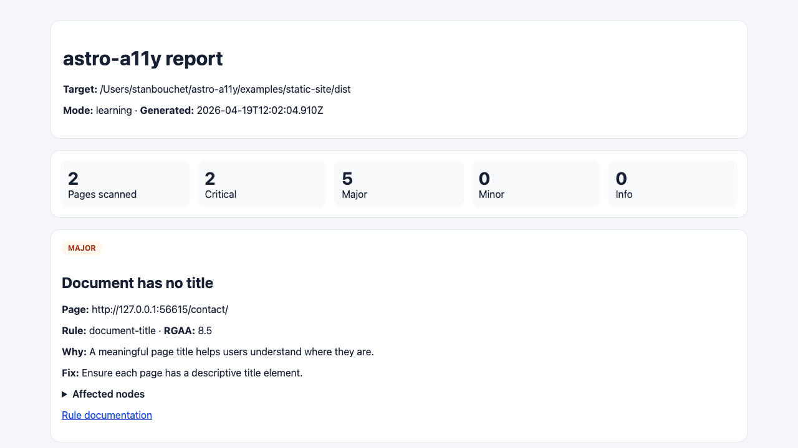

# astro-a11y

[English](./README.md) | Français

[](https://nodejs.org)
[](https://accessibilite.numerique.gouv.fr/)

Garde-fous d’accessibilité pour les projets Astro.

`astro-a11y` est une boîte à outils orientée Astro qui scanne les pages rendues avec Playwright + axe, enrichit les résultats avec des recommandations actionnables, mappe les problèmes courants vers le RGAA, et s’exécute via CLI ou automatiquement en fin de build Astro.

## TL;DR (30 secondes)

Nouveau site Astro :

```bash
pnpm create astro@latest mon-site && cd mon-site
pnpm add -D @astro-a11y/astro-integration
# Ajouter l'intégration dans astro.config.mjs (voir Guide débutant)
pnpm astro build
```

Site existant :

```bash
# Projet Astro existant -> intégrer puis build
pnpm add -D @astro-a11y/astro-integration
pnpm astro build

# Ou scan direct d'un build / d'une URL
npx astro-a11y check ./dist --mode balanced
npx astro-a11y check https://example.com --mode paranoid --allowed-domains example.com
```

Rapports : `dist/astro-a11y/` (intégration Astro) ou fichier défini avec `--output` (CLI).

## Démarrage rapide

```bash
pnpm install
pnpm build
pnpm test
pnpm example:scan
```

## Exemple de sortie

Des artefacts d'exemple versionnés issus de `pnpm example:scan` sont disponibles ici :

- [Sortie terminal](./docs/examples/example-terminal.txt)
- [Rapport JSON](./docs/examples/example-report.json)
- [Rapport Markdown](./docs/examples/example-report.md)
- [Rapport HTML](./docs/examples/example-report.html)

Capture du rapport HTML généré :



## Guide débutant

### Cas 1 - Monter un nouveau site Astro avec astro-a11y

1. Créer votre site Astro.
2. Installer l’intégration dans le site.
3. Ajouter l’intégration dans `astro.config.mjs`.
4. Lancer le build et lire le rapport généré.

Exemple :

```bash
# 1) Nouveau projet
pnpm create astro@latest mon-site
cd mon-site

# 2) Dépendance
pnpm add -D @astro-a11y/astro-integration
```

```js
// 3) astro.config.mjs
import { defineConfig } from 'astro/config';
import astroA11y from '@astro-a11y/astro-integration';

export default defineConfig({
  integrations: [
    astroA11y({
      mode: 'balanced',
      failOnBuild: false,
      writeReports: true
    })
  ]
});
```

```bash
# 4) Génération + scan automatique en fin de build
pnpm astro build
```

Par défaut, les rapports sont écrits dans `dist/astro-a11y/`.

### Cas 2 - Brancher astro-a11y à un site existant

Vous avez deux options selon votre contexte :

- Option A : vous avez un projet Astro et vous voulez un scan à chaque build -> utilisez l’intégration Astro.
- Option B : vous avez déjà un site statique ou une URL de préprod/prod -> utilisez la CLI `astro-a11y check`.

Option A (projet Astro existant) :

```bash
pnpm add -D @astro-a11y/astro-integration
```

Ajoutez ensuite la même config que dans le Cas 1, puis :

```bash
pnpm astro build
```

Option B (site déjà déployé ou dossier `dist` existant) :

```bash
# Scan d'un dossier de build local
npx astro-a11y check ./dist --mode balanced

# Scan d'une URL distante (avec garde-fous de domaine)
npx astro-a11y check https://example.com --mode paranoid --allowed-domains example.com
```

### Comprendre les résultats rapidement

- `terminal` : lisible dans la console (par défaut).
- `json` : exploitable en CI.
- `html` : partageable avec des non-tech.
- `markdown` : pratique pour ticketing / PR.

Exemple de génération de rapport HTML :

```bash
npx astro-a11y check ./dist --format json --output reports/report.json
npx astro-a11y report --input reports/report.json --format html --output reports/report.html --safe-report
```

## CLI

```bash
astro-a11y check <target> [--mode strict|balanced|learning|paranoid] [--format terminal|json|html|markdown]
astro-a11y report --input ./reports/report.json [--format terminal|json|html|markdown] [--safe-report]
```

Exemples :

```bash
astro-a11y check ./dist --mode balanced
astro-a11y check https://example.com --mode paranoid --allowed-domains example.com
astro-a11y check https://example.com --format json --output reports/report.json
astro-a11y report --input reports/report.json --format html --output reports/report.html --safe-report
```

## Intégration Astro

```js
import { defineConfig } from 'astro/config';
import astroA11y from '@astro-a11y/astro-integration';

export default defineConfig({
  integrations: [
    astroA11y({
      mode: 'balanced',
      failOnBuild: false,
      writeReports: true
    })
  ]
});
```

Les rapports sont écrits dans `<dist>/astro-a11y/` par défaut.

## Pour la communauté

Le projet est maintenu par une seule personne, et les contributions sont bienvenues.

- Guide de contribution : [CONTRIBUTING.md](./CONTRIBUTING.md)
- Support et attentes : [SUPPORT.md](./SUPPORT.md)
- Direction produit : [ROADMAP.md](./ROADMAP.md)
- Politique sécurité : [SECURITY.md](./SECURITY.md)

## Structure du dépôt

- `packages/core` - moteur de scan, sécurité, mapping RGAA
- `packages/reporters` - reporters terminal, JSON, HTML, Markdown
- `packages/cli` - point d’entrée CLI
- `packages/astro-integration` - intégration Astro
- `examples/static-site` - fixture de site statique
- `tests` - tests automatiques

## Positionnement sécurité

- Local-first par défaut
- Pas de télémétrie
- Cibles distantes sensibles bloquées sauf autorisation explicite
- Mode paranoid pour scans distants stricts
- Workflow d’audit sécurité dédié
